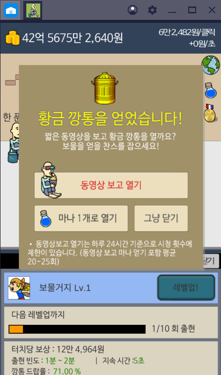

<h2>보물거지 자산 인벤토리 구걸도사</h2>

* <h4> 자산 </h4>
  * 부동산 
  <table>
    <tr>
      <th>건물</th>
      <th>가격(원)</th>
      <th>수입(원/s)</th>
    </tr>
    <tr>
      <th>주택</th>
      <th>200,000,000</th>
      <th>1,000,000</th>
    </tr>
    <tr>
      <th>30평 아파5</th>
      <th>200,000,000</th>
      <th>2,000,000</th>
    </tr>
    <tr>
      <th>1층 상가</th>
      <th>1,000,000,000</th>
      <th>3,000,000</th>
    </tr>

    <tr>
      <th>5층 빌딩</th>
      <th>2,000,000,000</th>
      <th>4,000,000</th>
    </tr>
    <tr>
      <th>10층 빌딩</th>
      <th>5,000,000,000</th>
      <th>5,000,000</th>
    </tr>
    <tr>
      <th>20층 빌딩</th>
      <th>10,000,000,000</th>
      <th>6,000,000</th>
    </tr>
    <tr>
      <th>50층 빌딩</th>
      <th>100,000,000,000</th>
      <th>7,000,000</th>
    </tr>
  </table>

  * 미술품 (각각 구매시 스토리 카드)
  <table>
    <tr>
      <th>상품</th>
      <th>가격(원)</th>
      <th>수입(원/s)</th>
    </tr>
    <tr>
      <th>고ㅎ<가제트박사의초상></th>
      <th>87,700,000,000</th>
      <th>8,000,000</th>
    </tr>
    <tr>
      <th>피카초<도라버려의초상> </th>
      <th>101,200,000,000</th>
      <th>9,000,000</th>
    </tr>
    <tr>
      <th>뭉ㅋ<깜직한절규> </th>
      <th>127,400,000,000</th>
      <th>10,000,000</th>
    </tr>
    <tr>
      <th>피카초<메롱></th>
      <th>164,700,000,000 </th>
      <th>11,000,000</th>
    </tr>
    <tr>
      <th>폴네잔<패가왜이래> </th>
      <th>250,000,000,000</th>
      <th>12,000,000 </th>
    </tr>
    <tr>
      <th>폴고갱님<결혼할수있을까> </th>
      <th>300,000,000,000</th>
      <th>13,000,000</th>
    </tr>
    <tr>
      <th>레오나르도다빈티<모자르나> </th>
      <th>1,000,000,000,000</th>
      <th>14,000,000</th>
    </tr>
  </table>

  * 알바의 행복 (조건 : 각각 알바고용 레벨 30이상 달성시 각각 스토리 카드, 건물 살 때 각각 스토리 카드)
  <table>
    <tr>
      <th>알바</th>
      <th>20레벨 보너스(클릭)</th>
      <th>건물</th>
      <th>가격(원)</th>
      <th>수입(원/s)</th>
    </tr>
    <tr>
      <th>패셔니스타</th>
      <th>+5% </th>
      <th>세종무나회관</th>
      <th>500,000,000,000</th>
      <th>14,000,000</th>
    </tr>
    <tr>
      <th>화가</th>
      <th>+12%</th>
      <th>예술의 쩐당</th>
      <th>600,000,000,000</th>
      <th>15,000,000</th>
    </tr>
    <tr>
      <th>롹</th>
      <th>+22%</th>
      <th>올림픽 콘서트장 </th>
      <th>700,000,000,000</th>
      <th>16,000,000</th>
    </tr>
    <tr>
      <th>피아니스트</th>
      <th>+36%</th>
      <th>카네르기 홀</th>
      <th>800,000,000,000</th>
      <th>17,000,000</th>
    </tr>
    <tr>
      <th>축구선수</th>
      <th>+55%</th>
      <th>축구경기장 </th>
      <th>900,000,000,000</th>
      <th>18,000,000</th>
    </tr>
    <tr>
      <th>과학자</th>
      <th>+80%</th>
      <th>첨단과학 연구소 </th>
      <th>1,000,000,000,000</th>
      <th>19,000,000</th>
    </tr>
    <tr>
      <th>의사</th>
      <th>+120%</th>
      <th>최신식 종합병원</th>
      <th>2,000,000,000,000</th>
      <th>20,000,000</th>
    </tr>
    <tr>
      <th>판사</th>
      <th>+200%</th>
      <th>초대형 오락실</th>
      <th>3,000,000,000,000</th>
      <th>21,000,000</th>
    </tr>
    <tr>
      <th>왕</th>
      <th>+400%</th>
      <th>재밌니랜드 </th>
      <th>4,000,000,000,000</th>
      <th>22,000,000</th>
    </tr>
    <tr>
      <th>외계인</th>
      <th>+1000%</th>
      <th>사랑이 이루어지는 빌딩</th>
      <th>8,000,000,000,000</th>
      <th>23,000,000</th>
    </tr>
    <tr>
      <th>외계인 여자친구</th>
      <th>+2000%</th>
      <th>영원한 약속</th>
      <th>10,000,000,000,000</th>
      <th>?</th>
    </tr>
  </table>

  * 기업 (각각 구매시 스토리 카드)
  <table>
    <tr>
      <th>기업</th>
      <th>가격(원)</th>
      <th>수입(원/s)</th>
    </tr>
    <tr>
      <th>카카옹</th>
      <th>7,000,000,000,000</th>
      <th>30,000,000</th>
    </tr>
    <tr>
      <th>네이바</th>
      <th>21,000,000,000,000</th>
      <th>40,000,000</th>
    </tr>
    <tr>
      <th>페이스쿡 </th>
      <th>70,000,000,000,000</th>
      <th>50,000,000</th>
    </tr>
    <tr>
      <th>막도널드 </th>
      <th>81,000,000,000,000</th>
      <th>60,000,000</th>
    </tr>
    <tr>
      <th>ㅋㅋ콜라</th>
      <th>83,000,000,000,000</th>
      <th>70,000,000</th>
    </tr>
    <tr>
      <th>그글</th>
      <th>173,000,000,000,000 </th>
      <th>100,000,000</th>
    </tr>
    <tr>
      <th>애플들</th>
      <th>246,000,000,000,000</th>
      <th>100,000,000</th>
    </tr>
  </table>
  스토리 카드 예 시 
  </img>

* <h4>구걸도사</h4> ( 필요조건 : 2조 )
  <table>
    <tr>
      <th>Lv</th>
      <th>초당 터치 수 (회)</th>
      <th>스킬 지속 시간 (초)</th>
      <th>쿨타임 (초)</th>
    </tr>
    <tr>
      <th>1</th>
      <th>10</th>
      <th>10</th>
      <th>300</th>
    </tr>
    <tr>
      <th>2</th>
      <th>16</th>
      <th>13</th>
      <th>290</th>
    </tr>
    <tr>
      <th>3</th>
      <th>20</th>
      <th>17</th>
      <th>280</th>
    </tr>
    <tr>
      <th>4</th>
      <th>24</th>
      <th>19</th>
      <th>270</th>
    </tr>
    <tr>
      <th>5</th>
      <th>28</th>
      <th>22</th>
      <th>260</th>
    </tr>
    <tr>
      <th>6</th>
      <th>32</th>
      <th>25</th>
      <th>250</th>
    </tr>
    <tr>
      <th>7</th>
      <th>36</th>
      <th>28</th>
      <th>240</th>
    </tr>
    <tr>
      <th>..</th>
      <th>..</th>
      <th>..</th>
      <th>..</th>
    </tr>
    <tr>
      <th>N</th>
      <th>6+4N</th>
      <th>7+3N</th>
      <th>310-N (0이 끝)</th>
    </tr>
  </table>

* <h4>아이템</h4>
  * 아이템 레벨업 쿠폰
    - 보물거지가 떨구는 황금깡통을 통해서만 획득 가능 ( 확률 극히 낮음 )
  * 옷장
    - 보물거지...
  * 배경
    - 보물거지...
  * 펫
    - 보물거지...

* <h4>보물 거지</h4>
  <strong>터치 당 보상 = (클릭) X 2 + (초당) X 0.01</strong> 
  <strong>출현 빈도 = 1~2 분 (랜덤)</strong> 
  <strong>출현 시간 = 5 초</strong>
  - 깡통 드랍
  <table>
    <tr>
      <th>Lv</th>
      <th>깡통 드랍률(%)</th>
      <th>레어템 드랍률(%)</th>
    </tr>
    <tr>
      <th>1</th>
      <th>71</th>
      <th>0</th>
    </tr>
    <tr>
      <th>2</th>
      <th>72</th>
      <th>0</th>
    </tr>
    <tr>
      <th>3</th>
      <th>73</th>
      <th>0</th>
    </tr>
    <tr>
      <th>30</th>
      <th>100</th>
      <th>0</th>
    </tr>
    <tr>
      <th>..</th>
      <th>..</th>
      <th>..</th>
    </tr>
    <tr>
      <th>31</th>
      <th>100</th>
      <th>1</th>
    </tr>
    <tr>
      <th>32</th>
      <th>100</th>
      <th>2</th>
    </tr>
  </table>
  </img>
